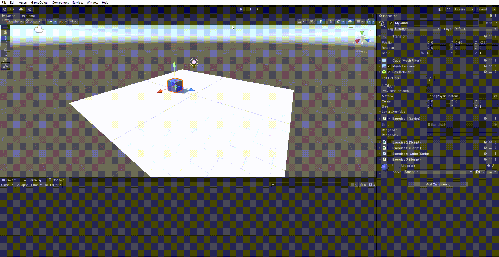
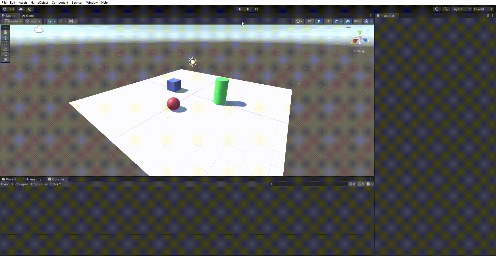
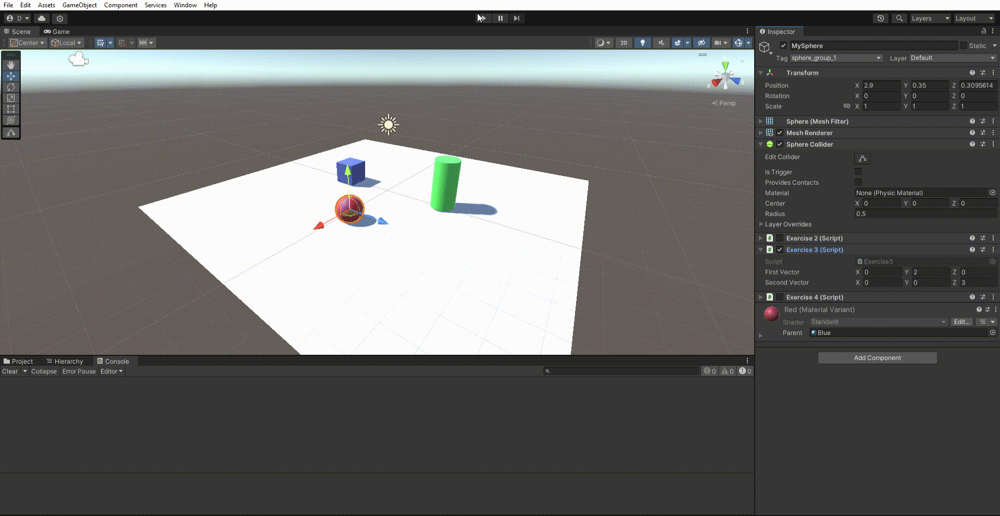
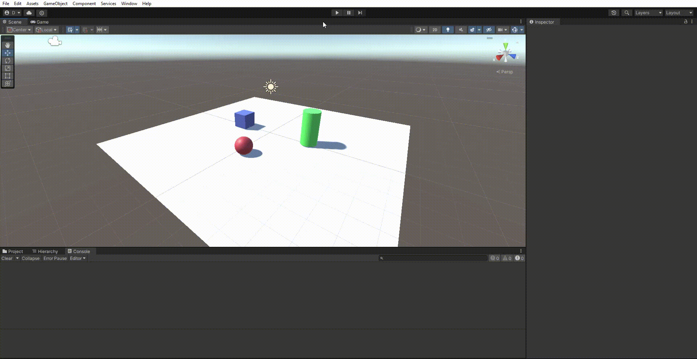
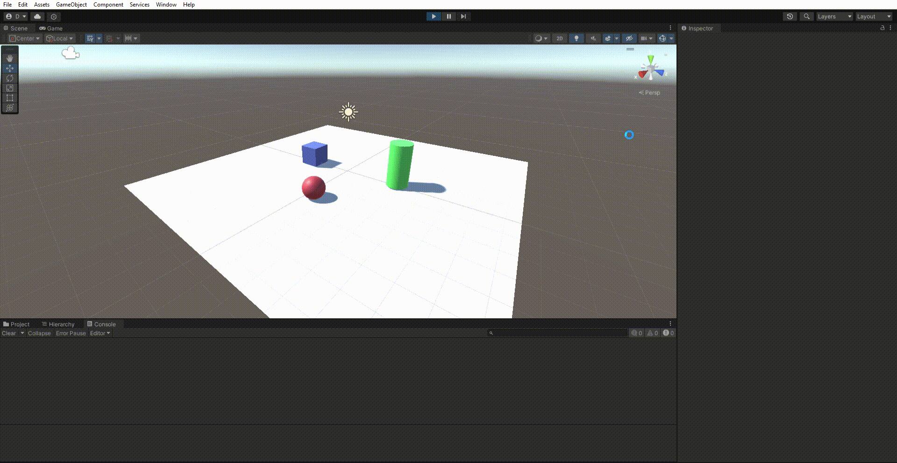
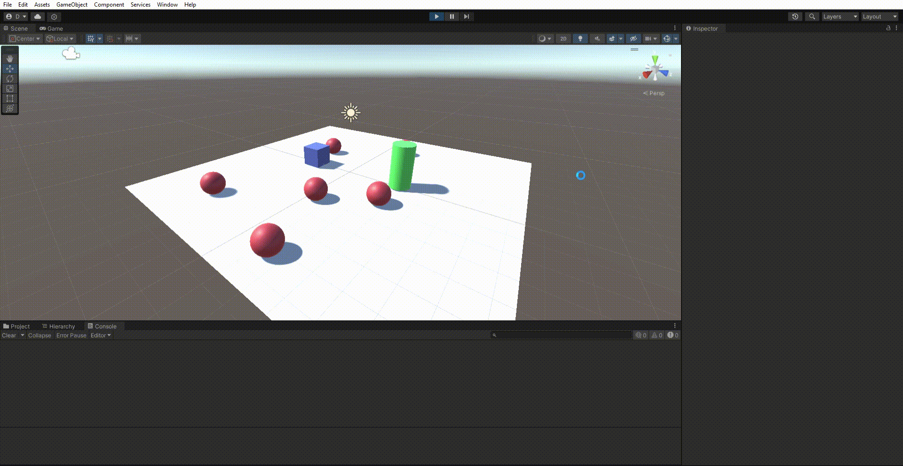

# II-P02-IntroductionToCSharp

Para esta práctica hemos trabajado con diferentes aspectos del lenguaje utilizado en Unity, C#, como el manejo de variables y vectores, la utilización de clases provenientes de la API de Unity como Random e Input, la manipulación de GameObjects ubicados en la escena desde el propio script, etc.

A continuación se mostrará el resultado de cada ejercicio con un GIF.

## Ejercicio 1

## Ejercicio 2

## Ejercicio 3

## Ejercicio 4

## Ejercicio 5

## Ejercicio 6

## Ejercicio 7

## Ejercicio 8

